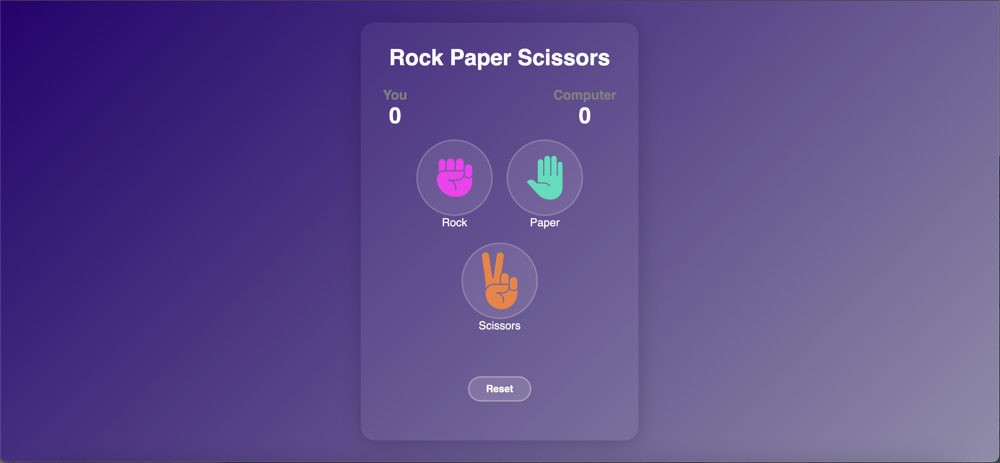
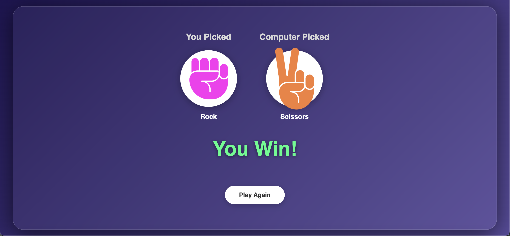
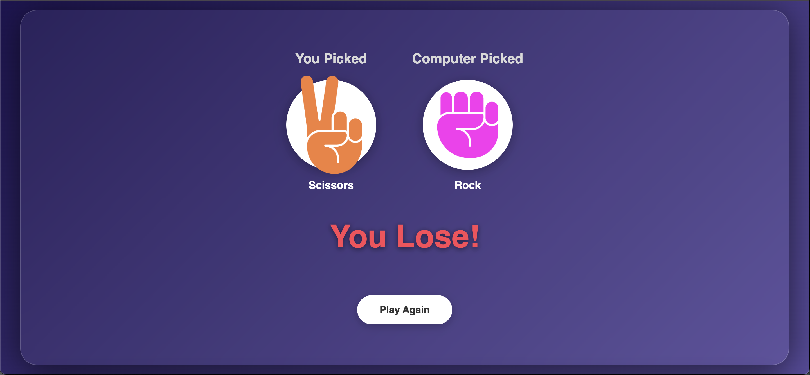
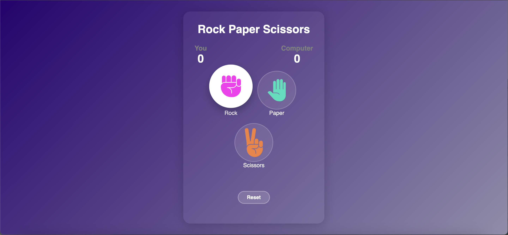

# 🪨 Rock Paper Scissors

A sleek, animated Rock Paper Scissors game built using HTML, CSS, and JavaScript. Featuring smooth UI transitions, responsive design, and immersive sound effects for a fun and interactive experience.

## ✨ Features

- 🎮 Play against a smart randomizing computer
- 💥 Animated selections with modal popups
- 🔊 Sound effects for clicks, wins, losses, and ties
- 📱 Fully responsive for mobile, tablet, and desktop
- 🌀 Reset and "Play Again" functionality
- 💡 Basic keyboard support via native buttons

## 📸 Screenshots

| Gameplay | Win | Lose | Select |
|---|---|---|---|
|  |  |  |  |

## 🚀 Live Demo

[GitHub Pages](https://zardrick.github.io/rock-paper-scissors)

## 🧠 What I Learned

- DOM manipulation and event delegation
- How to trigger audio in JavaScript
- CSS transitions, animations, and responsive layout techniques
- State management and conditional rendering
- Packaging and deploying a polished frontend project

## 🛠 How to Run Locally

1. Clone the repo:
   ```bash
   git clone https://github.com/zardrick/rock-paper-scissors.git
   ```
2. Open `index.html` in your browser

## 📦 Download

You can [download the ZIP](https://github.com/zardrick/rock-paper-scissors/archive/refs/heads/main.zip)

## 📃 License

This project is licensed under the [MIT License](LICENSE).
